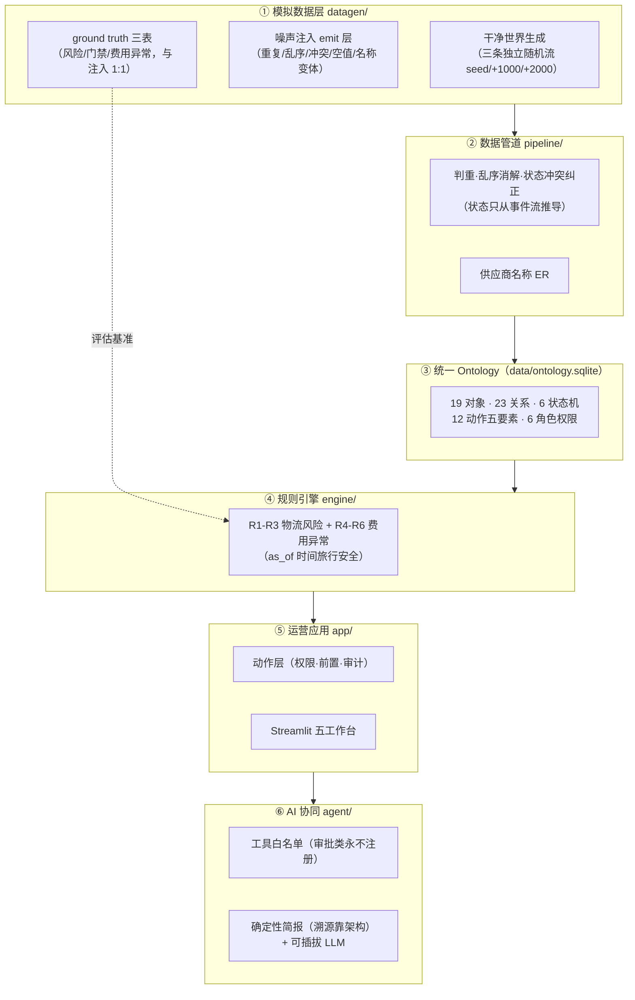
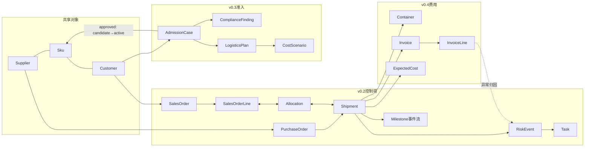
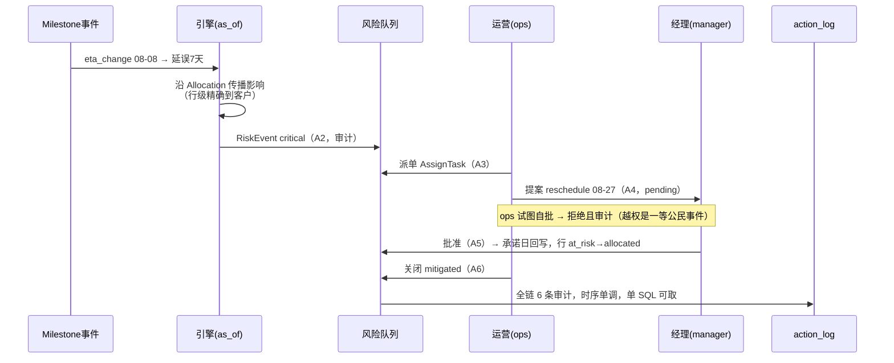

# 架构总览（v0.5 作品集）

一句话：**一个本体（ontology），三个业务闭环，一套治理机制。**
GitHub 原生渲染以下 Mermaid 图。

## 1. 分层架构

## 2. 对象图（核心链路）

关键设计：`RiskEvent→Task` 闭环被三个场景共用——延误、缺文件、停滞、超收、重复计费、
计划外费用六种规则的事件流动在**同一张风险队列**，走同一套派单/提案/审批/关闭/审计。

## 3. 闭环时序（以延误为例）

## 4. 治理与评估体系（本仓库真正的护城河）

- **决策日志 append-only**：D1-D11 / E1-E5 / F1-F5 + 勘误 N1-N5、P1-P4，
  每次建模变更有编号、有理由、有人批准
- **九个评估器**：datagen.verify（60+ 项）/ pipeline.evaluate / engine.evaluate /
  engine.evaluate_cost / 三个闭环无头测试 / agent.evaluate（22 题含红线）——
  同种子逐字节可复现，任何回归当场暴露
- **AI 护栏靠架构**：审批工具从未注册、事实字段只能来自对象、权限对人对 AI 同规——
  不编造不越权不是靠提示词求出来的
- **一次如实记录的 KPI 失败**：XE3（复盘 §0-v4），失败拆解出比达标更准的认知

## 5. 关键数字

| | |
| --- | --- |
| 业务场景 / 对象 / 关系 / 状态机 | 3 / 19 / 23 / 6 |
| 动作（五要素）/ 角色 / 风险规则 | 12 / 6 / 6 |
| Python 代码 | ~5,100 行（23 次提交，每次可验收） |
| 断言 | 70 条（69 过，1 条如实记败） |
| 演示数据 | 120 票货、147 柜、296 张发票、40 准入案件、363 条审计 |
