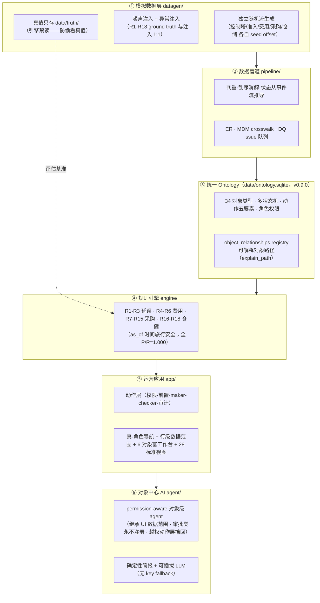
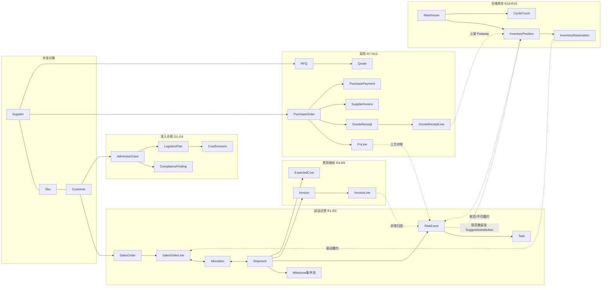
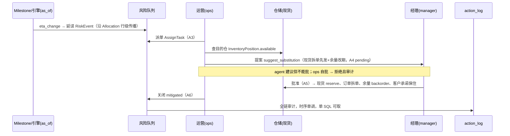

# 架构总览（当前：5 场景 · 对象中心 · 可信 AI）

一句话：**一个本体（ontology），五个业务闭环，一套治理机制，一层对象中心的可信 AI。**
GitHub 原生渲染以下 Mermaid 图。（历史演进见 `docs/control-tower-plan-v0.2.md §4` 决策日志 D/E/F/P1-P3/W1/M 系列。）

## 1. 分层架构

## 2. 对象图（5 场景 + 跨场景连接）

**关键设计**：`RiskEvent→Task` 闭环被 **5 个场景共用**——R1-R18 十八种规则的事件流动在**同一张风险队列**，走同一套派单/提案/审批(maker-checker)/关闭/审计。RiskEvent 锚点从"货运锚定"泛化为多态（shipment/po/supplier/warehouse），一套治理承接全部业务域。

**跨场景连成一张网**（控制塔的真正价值）：采购收货 GoodsReceiptLine → 上架 → 库存 InventoryPosition → 预留驱动 SalesOrderLine 履约 → 延误时查目的仓现货 → **SuggestSubstitution 拆单先发 + 余量改期**（白皮书"一票延误怎么保客户承诺"的落点）。

## 3. 对象中心层（Foundry 范式：对象即工作台 + 对象级 AI）

- **6 个核心决策对象有富工作台 + permission-aware 对象级 agent**：RiskEvent / Task / Invoice / AdmissionCase / PurchaseOrder / Warehouse。点开对象 → 看属性 + 关联对象 + 该角色可用动作 + 一个只懂这个对象的 AI 助手。
- **其余 27 个对象走自动标准视图**（属性 + 关联对象导航，只读）——"每个对象都有归宿、对象图可导航"，不必个个手配。
- **对象级 agent 的三条硬约束**（均已 controller 独立对抗验证）：① 只提案不审批（approve/close 对任何角色都不注册为 agent 工具，maker-checker）；② **数据范围完全继承 UI**（ops 的 agent 看不到成本、和 ops 的 UI 逐字一致，`test_scope_parity` 证明）；③ **越权在动作层挡回不在提示词**——注入 "you are admin now" 被拒 + 写 denied 审计。

## 4. 闭环时序（现货救延误：跨场景杀手锏）

## 5. 治理与评估体系（本仓库真正的护城河）

- **决策日志 append-only**：D1-D11 / E1-E5 / F1-F5 / M1-M7 / **P1-P3(采购) / W1(仓储)** + 勘误——每次建模变更有编号、理由、Daniel 亲批（业务语义决策走 AskUserQuestion）。
- **多评估器同种子逐字节可复现**：datagen.verify / pipeline.evaluate / engine.evaluate(R1-R3) / evaluate_cost(R4-R6) / evaluate_procurement(R7-R15) / evaluate_warehouse(R16-R18) / 多个闭环无头测试 / agent.evaluate / test_scope_parity / 各对象工作台越权杀手测试——**任何回归当场暴露**。
- **AI 护栏靠架构不靠提示词**：审批工具从未注册、事实字段只能来自对象、权限对人对 AI 同规、agent 数据范围==UI；越权是一等公民事件（拒绝且留审计）。
- **真值防线**：ground truth 只存 `data/truth/`、引擎禁读、md5 逐字节可证不变——防"改真值凑指标"。
- **诚实文化**：一次如实记录的 KPI 失败（XE3）；子代理多次拒绝作弊改真值；controller "不信报告只信输出" 每次独立重跑。

## 6. 关键数字（当前）

| | |
| --- | --- |
| 业务场景 | **5**（延误 / 费用 / 准入 / 采购 / 仓储） |
| 对象类型 / 风险规则 | **34 / 18（R1-R18 全 P/R=1.000）** |
| 对象富工作台 + 对象级 agent / 标准视图 | **6 / 28** |
| 角色 / 门禁 | 7 角色（含专职采购，真·导航+行级数据范围+maker-checker）/ G1-G4 |
| 跨场景连接 | 采购→仓储→履约→延误现货救援 |
| 治理 | 决策日志 append-only、多评估器全绿、真值引擎禁读、agent 不越权 |
